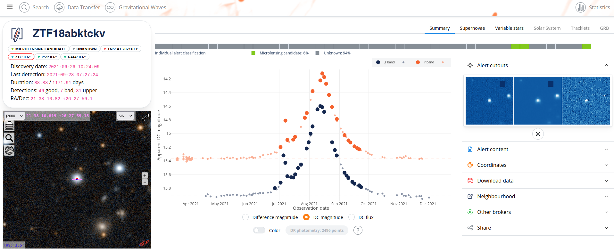

We report the discovery of an exoplanet using the microlensing effect. This event marks the first exoplanet found with Fink and is a rare example of an event observed outside the Galactic bulge.
<!--more-->

The event was observed outside the center of our galaxy and was detected by both space-based telescopes like Gaia and ground-based surveys such as ZTF and ASAS-SN. Fink's microlensing classification initially drew attention to this event, leading to observations by many other telescopes. From the data collected, we found that the lens system is about 1 kiloparsec away and consists of a small star, known as an M-dwarf, which has about half the mass of our Sun. This star is orbited by a planet similar to Jupiter, located beyond the region where ice can form. Our analysis suggests that the source star is likely a giant star with low metal content, situated in the halo of the galaxy. This event is a unique example of a binary-lens event occurring outside the galactic center, made possible by the combination of a disc and halo lensing the source star.

_Lightcurve for AT2021uey, or [ZTF18abktckv](https://fink-portal.org/ZTF18abktckv), around the main event in 2021. Data from alerts is shown with large colored circles, while small dots show data from ZTF Data Release. The rise of luminosity in July 2021 is due to the presence of the planet._

This event was difficult to describe because it was faint, and the signal from the exoplanet appeared before the main signal. With the launch of the LSST later this year, we expect to see many more events involving exoplanets. We are also working on improving our [microlensing classifier](https://github.com/Professor-G/MicroLIA), which will help us identify these events more accurately. This improvement will allow us to start follow-up observations sooner, helping us learn more about the characteristics of exoplanets.

This work was carried out by a large team of scientists and amateur astronomers from around the world, who conducted follow-up observations. For more information, see https://arxiv.org/abs/2503.22331 (accepted for publication in Astronomy & Astrophysics).
