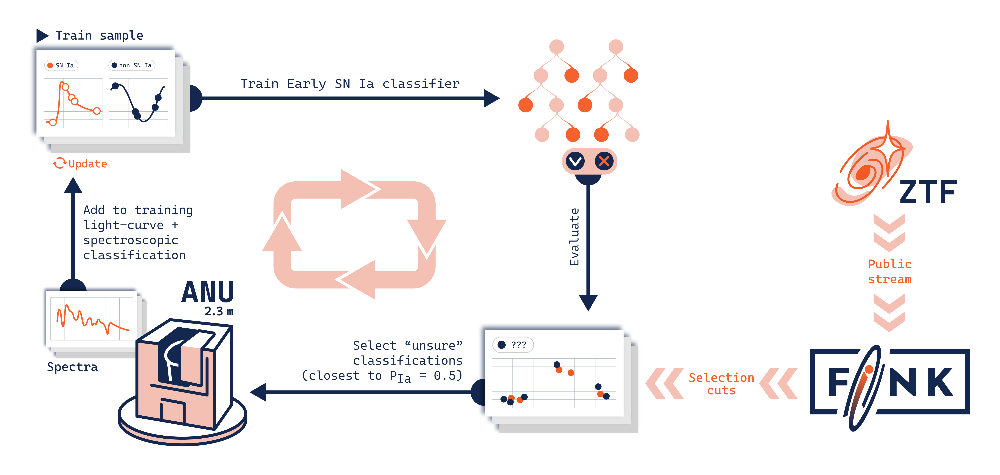
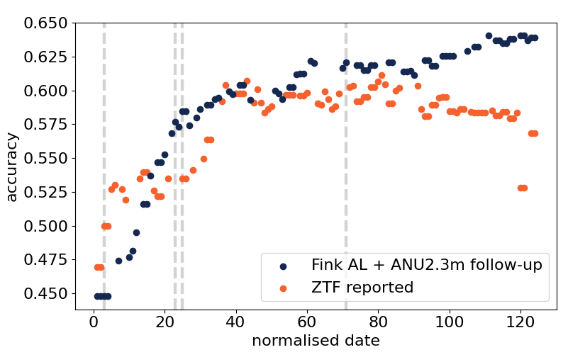

*How do we choose which objects to use our precious telescope time for follow-up?*
<!--more-->

For Rubin we won’t have enough telescope time to obtain spectra - breaking light in its full range of colours or wavelengths - to classify all supernovae and transients. An alternative is photometric classification, which uses the evolution of luminosity in different broad-band wavelengths, light-curves- instead of spectroscopy to classify transients. Light-curves are exactly what Rubin LSST and ZTF provide to Fink!

But how do we train these photometric classifiers?  Like the snake biting its tail, we train them using the objects we know which type are from spectroscopy!

*So how do we use our limited amount of spectroscopic time to improve photometric classifiers?*
<!--more-->

The Fink team has been developing a new way of selecting follow-up targets, using Active Learning. Active Learning is a Machine Learning technique where the model selects the most useful data to learn from. It asks questions like, “Which objects would help me learn the most if I knew their labels?”. In this work, we show for the first time that an Active Learning strategy is the best way to select which objects to follow-up spectroscopically and, as consequence,  improve our photometric classifiers. A handful no?

*How does it work?*  
We take the photometric classifier of early type Ia supernovae vs. non early type Ia supernovae from ([Leoni et al. 2022](https://www.aanda.org/articles/aa/full_html/2022/07/aa42715-21/aa42715-21.html) & [Ishida et al. 2019](https://academic.oup.com/mnras/article/483/1/2/5162860?login=false)) and train it with 20 known light-curves from supernovae and other transients. We then apply this classifier to new data from the Zwicky Transient Facility. Instead of selecting those objects with high probability, we select those that the classifier is most unsure of (probability ~0.5). These objects, if they are bright enough, are sent to be followed-up by the ANU 2.3m spectrograph. We get the spectra, we obtain the type of supernova or transient it is and we put this new object in the training set. Retrain - apply to ZTF data - and do this all over again!

_Active Learning loop schema. The loop starts with the Initial train sample which is used to train the Early SN Ia classifier, this algorithm is then applied to alerts processed by the Fink broker from the ZTF public stream. We select alerts which obtain the closest PIa to 0.5 and schedule spectroscopic follow-up with the ANU 2.3m if they have no spectroscopic classification. Once a label is obtained, we add the light-curves and labels for the selected events to the training set. The loop is repeated during the observing period._

*What do we find?*  
We find that at the beginning, our classifier has similar performance than adding “usual” follow-up targets. In this case, the usual follow-up targets are from ZTF TNS reported ones. But after adding ~60 new objects, our system recommends better objects to follow-up to improve the accuracy, efficiency of classification. A win that can save us one and a half nights of observation compared to 5.3 nights of other approaches.

_Evolution of classification metrics as a function of time from the FINK AL strategy (orange) and using all TNS reported ZTF classifications (blue)._

While doing this we don’t only select supernovae, our usual objects for training sets, but also microlensing events, AGNs, stars, etc… quite different from usual follow-up! 

You can see these results and more in our paper [Moller *et al.*, 2025](https://arxiv.org/abs/2502.19555).

