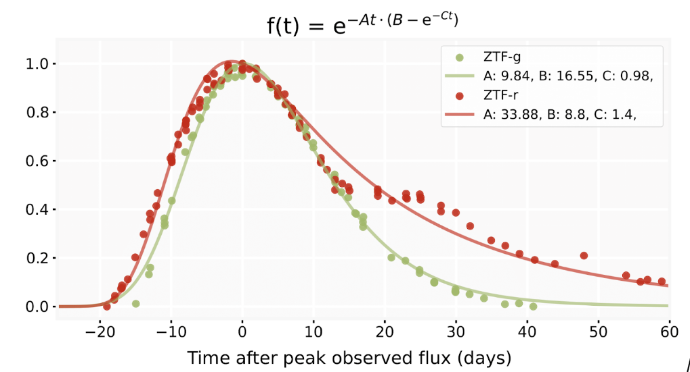
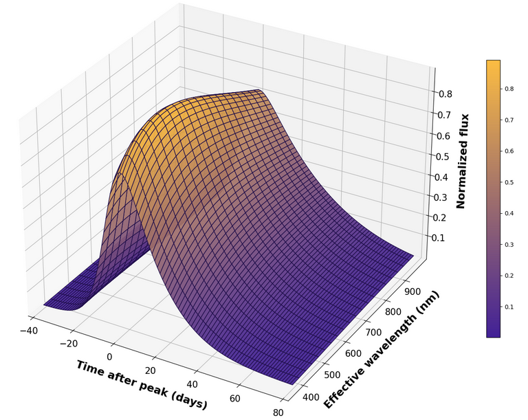

In order to deal with the unprecedented data volume of photometric data that will be produced by LSST, we need to optimize our approach to deal with very complex light curves. This work focused on the development of methods able to extract **as much information as possible from the light curves**. 

A common procedure used to extract information from a light curve is **to fit a phenomenological model** to the observations. However, in practice, it is not clear which model should be used for a given science case, or even if any of these models is optimal. In order to answer this question, the **Multi-view Symbolic Regression** (MvSR) [1] framework was developed. It is a data-driven method which automatically constructs a parametric model from a set of examples. It constitutes a new powerful tool to describe transient behavior. It has been used to discover **new models** that offer improvements, including better fit or lower number of parameters, compared to other available functional forms presented in the literature.

However, even with improved models, another challenge remained to be tackled. It concerns the proper description of light curves with measurements generated using different **wavelength filters**.  This thesis also includes the  **Rainbow framework** [2], developed within the [SNAD team](https://snad.space/), which enables simultaneous multi-wavelength light curve fitting based on the assumption that the transient behaves as a blackbody. This hypothesis enables the reconstruction of a 2-dimensional continuous surface across wavelength and time. We show that such representation encapsulates much more information regarding the nature of the source, and in particular greatly **improves classification performances**.

These tools have already been used within the Fink broker. They have enabled high accuracy in several classifiers, indicating that the information extracted ensure a robust light curve classification. Such results constitute an important step in the preparation for a new and more complex generation of astronomical experiments. 

[1] Russeil *et al.*, 2024, [*Multiview Symbolic Regression*](https://dl.acm.org/doi/10.1145/3638529.3654087), GECCO '24: Proceedings of the Genetic and Evolutionary Computation Conference, [arXiv:astro-ph/2402.04298](https://arxiv.org/abs/2402.04298)  
[2] Russeil *et al.*, 2023, [*RAINBOW: A colorful approach to multipassband light-curve estimation*](https://www.aanda.org/articles/aa/full_html/2024/03/aa48158-23/aa48158-23.html),  Astronomy & Astrophysics, Volume 683, id.A251, 13 pp.

Both works were part of the PhD thesis, [*Feature engineering and machine learning for 21st Century Astronomy*](https://theses.hal.science/tel-04818477v1), by Dr. Etienne Russeil, defended at Université Clermont Auvergne and which was awarded the [2025 Prix Jeune Chercheur](https://clermont-ferrand.fr/prix-jeunes-chercheurs). 

