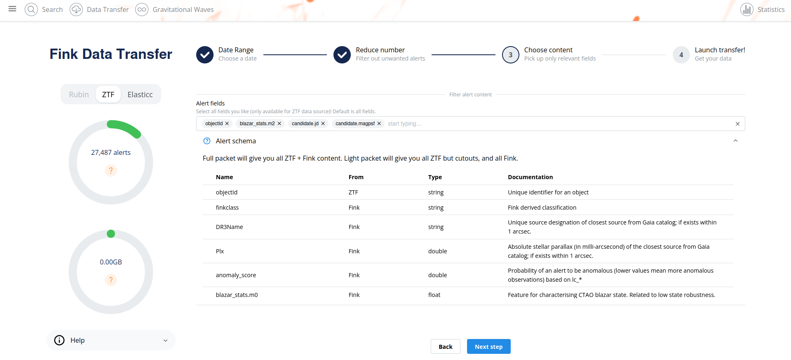
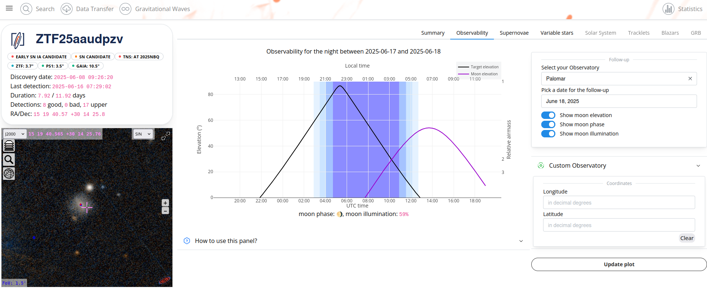
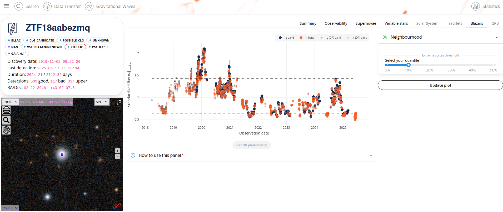
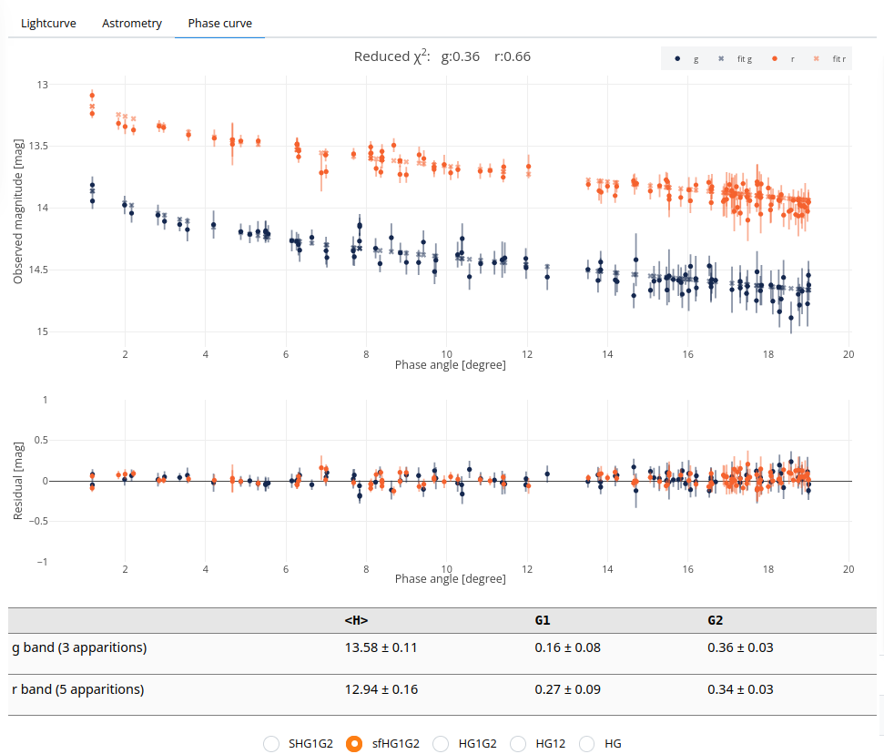

We are delighted to announce the release of Fink Science Portal version 8. 
<!--more-->

There are many new functionalities with respect to vesion 6, including observability tab, and a brand new Data Transfer interface. Release notes can be found at: 
- https://github.com/astrolabsoftware/fink-science-portal/releases/tag/7.0
- https://github.com/astrolabsoftware/fink-science-portal/releases/tag/8.0

## Data Transfer

The major change in this release is the new interface for the Data Transfer service. In preparation for Rubin, we aimed to make it easier for users to access alert data. We understand that during the initial months, the templates will be gradually developed, and the Fink science module will need to adapt. As a result, the alert data may not be fully science-ready. However, we believe that users should have seamless access to the data to continue preparing for the analysis of the Rubin alert stream and to enhance Fink processing quickly.

The new Data Transfer service offers the following features:

- Select any observing night(s) for different survey (ZTF, and forthcoming LSST).
- Apply a variety of filters, including Fink-derived classes, nightly filters, or any other arbitrary conditions on alert fields.
- Define the specific alert content to be retrieved.

To facilitate the construction of filters and the selection of fields, we have included information on the alert schema:

The documentation for the service has been updated accordingly: https://fink-broker.readthedocs.io/en/latest/services/data_transfer

## Observability tab

When you encounter an interesting transient, your first instinct is likely to plan observations. However, the initial question is whether this target is accessible from your preferred site. While there are various observability tools available, we aimed to simplify the process by integrating one directly into the object page. This minimizes effort and streamlines follow-up planning.

You can select your observatory from a predefined list and directly input coordinates. Special thanks to [Julian](https://github.com/JulianHamo), PhD candidate at IJCLab, for the implementation!

## Extreme state tab

In the context of Active Galactic Nuclei in general, and Blazars in particular, one often would like to know if the object is in high flux state (e.g. flaring state), or in low flux state (e.g. to plan spectroscopic observation to take a redshift of the host galaxy) compared to its median evolution. To ease this process, we added a new tab to easily vizualise flux quantiles:

Again, special thanks to [Julian](https://github.com/JulianHamo), PhD candidate at IJCLab, for the implementation! A science paper is coming on this.

## ZTF Data Release

You may have noticed that you can add ZTF Data Release measurements on the object page, in addition to alert measurements. This allows you to view either detections prior to 2019 (when Fink was not yet active) or non-detections. Since IRSA was often slow to respond, we have switched to using the public API from SNAD. Now, you can access Data Release measurements in an instant! 

Thanks [Sergey](https://github.com/karpov-sv) for the suggestion!

## Variable stars

### Faster period estimation

We are now using [nifty-ls](https://github.com/flatironinstitute/nifty-ls) to compute the periodogram for variable stars, and extract the best fitted period. This is much faster than the previous library (gatspy) we were using before.

### Additional information from Gaia

We now include Gaia information about variability in each alert packet. The two fields `phot_variable_flag` (`gaiaVarFlag`) and `Class` (called `gaiaClass`) were added. Thanks [steventgk](https://github.com/steventgk) and the LSST Variable Stars and Milky Way group for suggesting the addition!

## Solar system object

A new Phase Curve model, called sfHG1G2, was added. The model is described in [Colazo et al 2025](https://arxiv.org/abs/2503.05412). It is a single fit across all apparitions/oppositions, where the fitted H values can vary for each opposition, but G1 and G2 remain the same for all. This means we fit N+2 parameters, where N is the number of oppositions.

