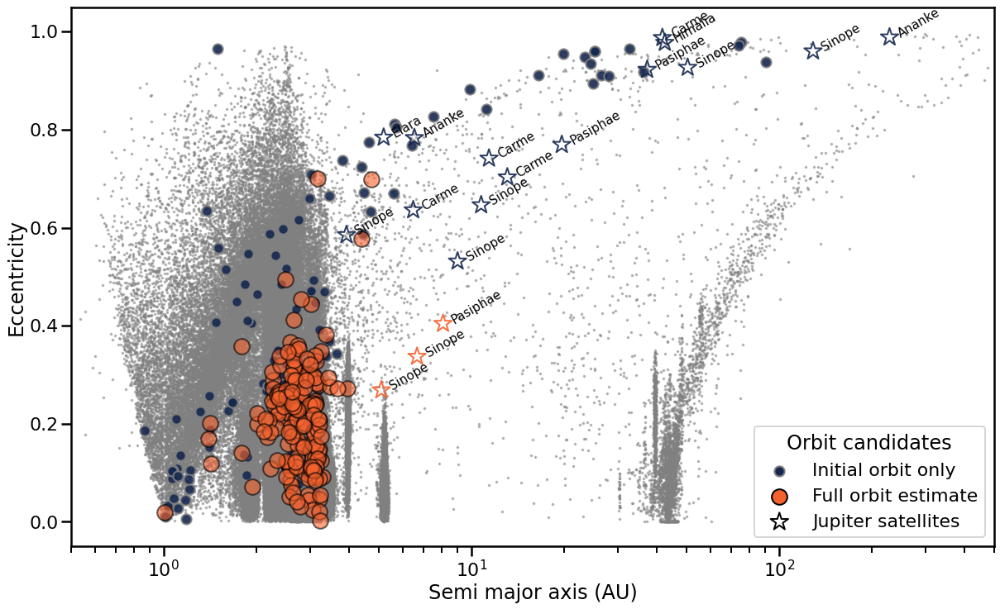

The transient seen through Fink allows us to study very near and very far astronomical objects in the same breath!
<!--more-->

This work addresses the challenge of associating signals from optical telescopes with high-energy astrophysical events such as gravitational waves, gamma-ray bursts (GRBs), and neutrinos. To tackle this, we developed the  Fink-MM (Fink Multi-Messenger) module, a real-time system for identifying optical counterparts to multi-messenger alerts using spatial and temporal coincidence filtering, enhanced with statistical methods tailored to GRBs. This led to the successful identification of [GRB 230827256](https://ui.adsabs.harvard.edu/abs/2023GCN.34574....1L/abstract) optical counterpart!

While working on fast transient identification, it became clear that foreground moving objects, including potentially new and unreported asteroids, were posing a challenge. Therefore, a second major contribution is Fink-FAT (Fink Asteroid Tracker), a tool designed to detect and reconstruct the trajectories of previously unknown asteroids using sparse and noisy data from optical alerts. By estimating orbital parameters and generating ephemerides, Fink-FAT enables the classification and confirmation of mobile objects that would otherwise contaminate searches for extragalactic transients. The tool was validated through follow-up campaigns with ground-based telescopes, which confirmed known objects, identified moons of Jupiter, and potentially revealed new, uncatalogued solar system bodies. This work is described in [Le Montagner et al., 2023](https://www.aanda.org/articles/aa/full_html/2023/12/aa46905-23/aa46905-23.html).

Finally, we explored the need for follow-up infrastructure to support real-time discovery. To address this, we initiated the design of GVOM (Ground Variable Object Monitor), a coordination system for scheduling and managing follow-up observations of transient candidates. Though still a prototype, GVOM represents a step toward a fully automated multi-messenger detection and characterisation pipeline. The work showcases how scalable, distributed tools can prepare for the data-intensive future of time-domain astronomy with the upcoming LSST.

All the above contributions are part of the PhD thesis, [*High-Energy Transient Universe in the Era of Large Optical Surveys*](https://theses.hal.science/tel-04836942/), by Dr. Roman Le Montagner, defended at Universite Paris-Saclay, 2024. 

