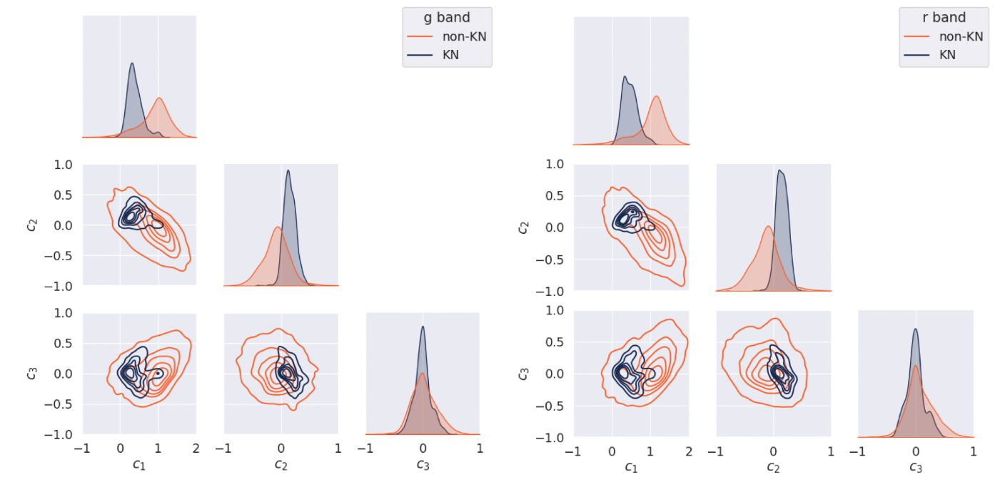

Since the dawn of multi-messenger astronomy, with the detection of gravitational wave (GW) event [GW170817](https://en.wikipedia.org/wiki/GW170817), the community has been in pursuit of detecting more of their electromagnetic (EM) counterparts known as kilonovae (KNe). For this purpose, large regions need to be scanned in a few days to look for EM counterparts within the localization obtained from GW signals. The survey strategy of the upcoming Large Survey of Space and Time (LSST) will answer this need. To prepare for the arrival of LSST, we have developed within Fink a fast transient classification algorithm to process precursor data from the Zwicky Transient Facility.

Using principal component analysis, this module generates features designed to grasp different light curve behaviors to separate fast (KN-like) from slow (non-KN-like) evolving events (see Figure 1). Mimicking ZTF alert-like 30 days of simulated data, the classifier obtained 69% precision and 70% recall for KN, with most of the contamination coming from other fast transients. The trained model is integrated into the Fink broker and has been distributing fast transients to the community. Details were reported in [Biswas *et al.*, 2023](https://www.aanda.org/articles/aa/full_html/2023/09/aa45340-22/aa45340-22.html).

This module represents one crucial link in an intricate chain of infrastructure for multi-messenger astronomy being put in place by the Fink broker team in preparation for the arrival of LSST data.

_c1, c2, and c3 are features generated separately for the r and g-bands of ZTF. The difference shows that short-term (KN-like) and long-term (non-KN like) can be separated in this feature space._

This work is part of the PhD thesis, [*Designing novel Machine Learning techniques to address the volume and complexity of the Rubin LSST data:separation of blended galaxies and transients classification in alert streams*](https://theses.fr/s299080), by Dr. Biswajit Biswas, defended at Université Paris sciences et lettres, 2024.

