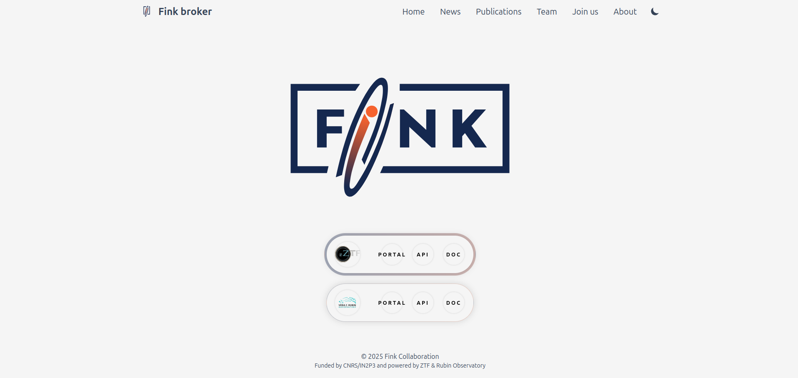

As the Vera C. Rubin Observatory has officially begun its operations phase, we are moving towards a new era for the transient sky. Check out how Fink will give access to ZTF and LSST.
<!--more-->

We have been processing the public ZTF alert stream since 2019, which has enabled us to build numerous services based on this data stream. [Many papers have been published](https://fink-broker.org/papers/), and we have received valuable feedback from our users (thank you all!). Over the years, these services have become an integral part of the daily workflow for many students and researchers working in the transient sky. We will continue to support and process the ZTF alert stream until the project's conclusion, which is currently extended until the end of 2026.

With the upcoming start of the LSST stream, we faced a crucial decision: whether to merge ZTF and LSST processing along with their data products to maintain a single interface for our users, or to keep ZTF and LSST as two separate systems with interconnections between them.

Over the months, it became clear that the ZTF and LSST data products were quite distinct. Attempting to create a single system from both surveys would yield more challenges than benefits. Thus, we have developed a new system! Of course, the LSST system benefits from all the development work completed for ZTF, and the user-facing services will remain quite similar, albeit improved! 

Our processing and storage infrastructures for ZTF and LSST will remain separate. The Fink instance for ZTF is hosted at Université Paris Saclay, France, in the VirtualData cloud operated by IJCLab. For LSST, we have successfully deployed a fresh instance of Fink in the CC-IN2P3 cloud. The resources involved are substantial: for LSST, this comprises approximately 500 cores and 1 PB of storage dedicated to processing and long-term storage of the alert stream over the 10 years of the LSST survey.

As a direct consequence of this split, the addresses for accessing online services will be changing. We have aimed to keep these changes simple and intuitive:

- Fink website (unchanged): https://fink-broker.org
- Fink Science Portal: https://{suvey}.fink-portal.org
- Fink REST API: https://api.{suvey}.fink-portal.org
- Fink documentation: https://doc.{suvey}.fink-broker.org

where `survey` is either `ztf` or `lsst`. The current addresses you have been using for years will remain active for a period to allow users time to transition their codes and bookmarks. After this transition period, we will only maintain the addresses listed above.

To make this change even easier, you can find all relevant links on the Fink website—just hover below the logo. 

The documentation website for LSST is already live, and it will be updated as we progress through commissioning, providing you time to familiarize yourself with the LSST alert schema and its differences from ZTF.

We will keep you informed through the next stages, and as soon as data become available. 

For now, do not forget to **update the addresses** for your online services of choice and be prepared for exciting new times ahead! 
