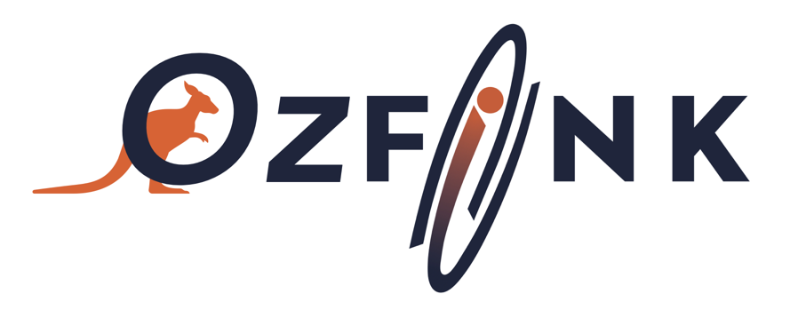

# OzFink Workshop 2025: Building Momentum for Rubin's First Light

**Event webpage:** https://indico.in2p3.fr/event/37156/

Our second Australian workshop was held in Melbourne between the 10th and 12th of November 2025 at Swinburne University. We had 45 participants, with early-career researchers making up the vast majority—PhD students, postdocs, and other students representing almost 90% of attendees. It was a fantastic opportunity to dive deeper into Fink's capabilities and continue building our community in preparation for Rubin LSST!

We had a very dynamic schedule mixing talks, hands-on tutorials, and lively discussion sessions. Participants even got to play with Rubin simulations, getting practical experience with the data streams we'll soon be working with. The workshop drew attendees from Australia, the Oceania region and beyond, with many participants joining us from New Zealand, as well as colleagues from China, France, and Brazil.

We are grateful for the support from ARC CoE OzGrav and CNRS/IN2P3 that made this event possible. We thank also the CNRS Oceania representative Prof. Pascal Marty who joined us at the workshop with opening remarks.

The enthusiasm from our early-career researcher cohort was truly inspiring—it's clear there's tremendous excitement about time-domain astronomy in the Rubin era and the role Fink will play in our region. Thanks for three productive days, and here's to the collaborations and discoveries ahead!