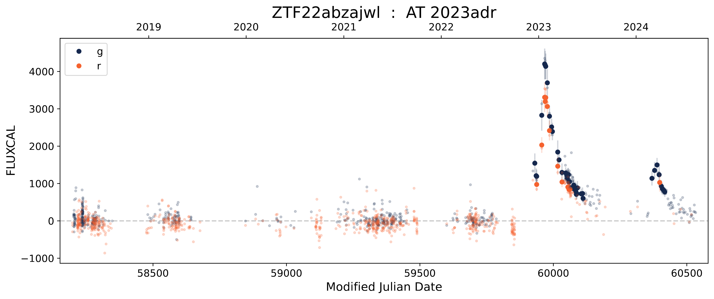

A tidal disruption event (TDE) occurs when a star passes too close to a supermassive black hole and is torn apart by its gravity, producing a luminous, transient flare. They are rare phenomena that are still largely not understood and for which each additional example is very valuable.
Given the expected number of transient alerts from ZTF, and soon Rubin, there is a need for automated and robust classification methods. Ideally, it would be even more optimal to identify them before their peak brightness, when spectroscopic follow-up is still possible. In this context, an early TDE classifier was developed within Fink to search for them within the ZTF alert stream.  

The model was trained and validated on TNS-classified ZTF light curves, which include a wide range of contaminant classes such as supernovae and active galactic nuclei. The classifier achieves 76% recall, despite the limited available information before peak. We show that, out of the known TDEs that pass the selection cuts, half of them are flagged as TDEs before halfway through their rise, proving the feasibility of early classification. The implementation details have been published in Llamas [Lanza & Karpov *et al.* 2025](https://www.aanda.org/articles/aa/full_html/2026/01/aa56558-25/aa56558-25.html).

A companion paper ([Quintin et al. 2025](https://arxiv.org/abs/2511.19016)) presents a catalogue of every promising TDE candidate that was discovered by the model. In total, 19 optical nuclear transients are reported, which include rare behaviours such as multiple peaks (see Figure) and flares in active galaxies. In particular, an exceptionally long-lived transient (over 5 years) was discovered. The analysis further warns about the high risk of machine learning models overlooking some events.

Efforts are now being directed toward the adaptation of the science module for LSST data, which should hide a considerable number of TDEs.

