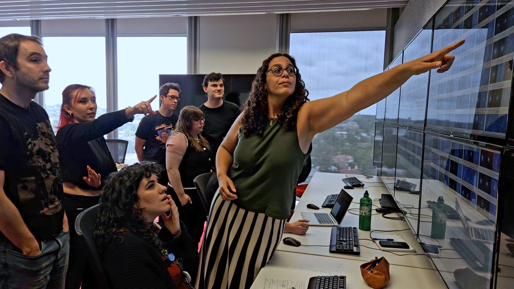
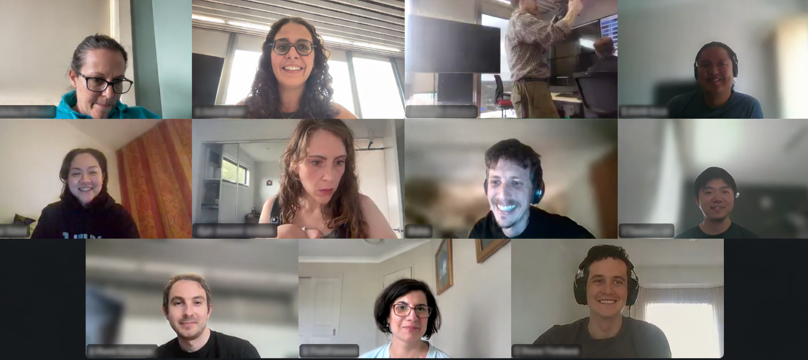

On 25 February 2026, 1:30am (CET) Fink started to process public alerts produced by the Vera C. Rubin Observatory. 

The system proved to be resilient, reaching almost 500 requests per minute moments after  the start of public operations. 
<!--more-->

At the same time, 11:30 am (AEDT), a group of Fink members were gathered  at Swinburne University - Australia, in  a hybrid meeting to collectively inspect candidates and select targets to be sent for spectroscopic confirmation by the Siding Spring Observatory.  

The meeting was attended by researchers and students from Swinburne. Online participants included Fink members from other universities in Australia, New Zealand and France. 

This was the first time a complete Rubin observation cycle was put in practice, involving a network of engineers, data scientists, domain experts and observers. All coordinating actions in a global effort that worked flawlessly. 

The community aspect of Fink’s  *community driven* mission shined its brightest under pressure. 

The data was generated in Chile and sent to a data center in the USA, subsequently arriving at CC-IN2P3, France. There, it interacted with filters and machine learning models developed by domain experts from all over the world before being delivered to personal computers of users located in more than 20 countries. The entire data journey lasted not more than a couple of minutes. 

The processing continued for approximately 6 hours, resulting in  approximately 800 000 alerts being successfully consumed in the first night of public operations. The data contained a large variety of sources, including around 50 supernova candidates,  and many solar system objects.

Beyond the undeniable technological achievement marked by this event, the most impressive feature of the day was the manifestation of beautiful human connections among our members, built through the first 7 years of this adventure. 

We are up to the task ahead: an unprecedented decade of discoveries for transient astronomy. 

Taking this experience as evidence of the human and scientific potential enclosed in the Fink community, we can brace ourselves for exciting few years ahead!

Let it begin.

You can access all LSST/Fink services through: [https://lsst.fink-portal.org/](https://lsst.fink-portal.org/)

 

