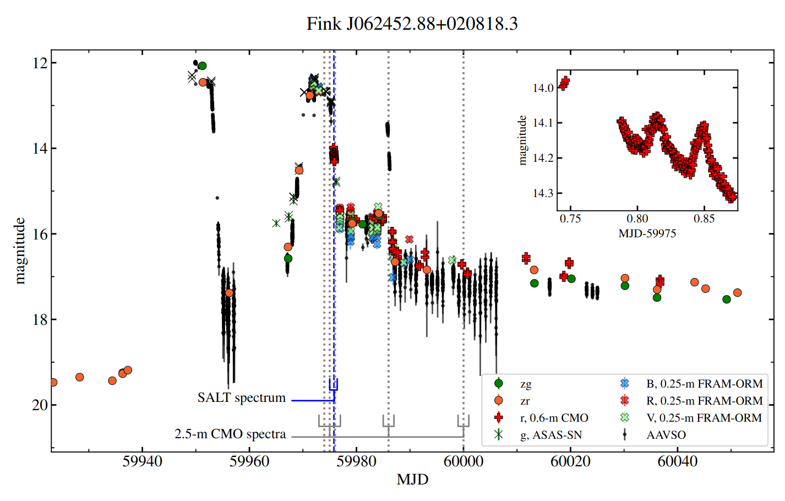

The Fink anomaly detection pipeline has delivered its first-year science results, demonstrating how broker-level machine learning can be turned into real astrophysical discoveries when combined with expert validation and follow-up observations. 
<!--more-->

Operating on the ZTF alert stream since 25 January 2023, the pipeline ranks the most unusual alerts each night and distributes the top candidates through Slack, Telegram, and the Fink API, enabling rapid inspection by astronomers.  

During its first year of operation, the system recovered a broad range of scientifically interesting sources. Among the most remarkable discoveries are the rare AM CVn system Fink J062452.88+020818.3, interpreted as only the third reliably classified WZ Sge-type object in this class, the unusual transient SN 2023mtp with a precursor, and the variable source Fink J222324.32+744222.0, whose optical and infrared behaviour points to a UX Ori-type object with a changing dusty environment.  

Among selected targets, the Fink anomaly detection module identified 33 supernova candidates, including 30 previously unreported events that were submitted to the Transient Name Server. Among them are candidates for superluminous supernovae, hostless transients, and “pure” Type Ia supernovae in low-dust environments. In addition, the pipeline led to the discovery of nine new dwarf novae, all of which were reported to the AAVSO VSX database.  

These results show that anomaly detection in time-domain astronomy is most powerful when it goes beyond ranking unusual light curves and becomes part of a full discovery chain, from automated selection to expert analysis and follow-up. The work also highlights the importance of human feedback: through a public [Telegram bot](https://t.me/ZTF_anomaly_bot), astronomers helped to label candidates and improve the model, paving the way towards future personalized anomaly detection tools within Fink.

The complete analysis is presented in [Pruzhinskaya *et al.*, 2026](https://arxiv.org/pdf/2603.29511).
