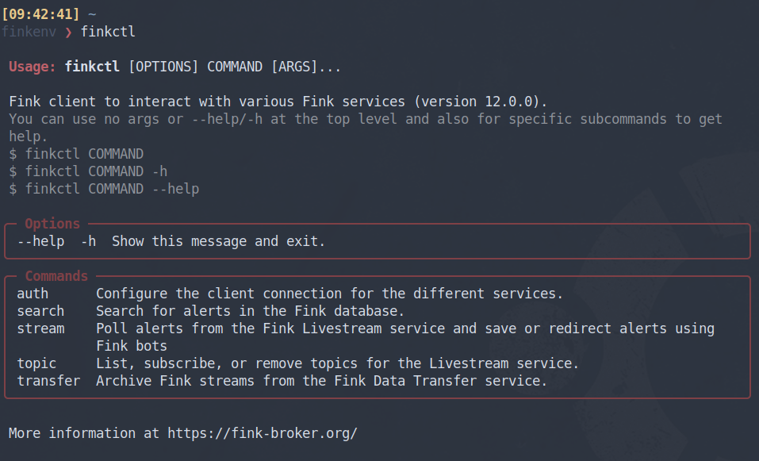
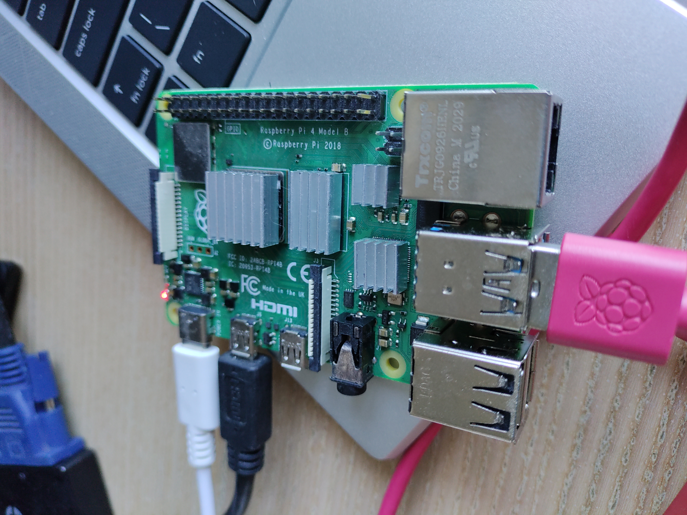
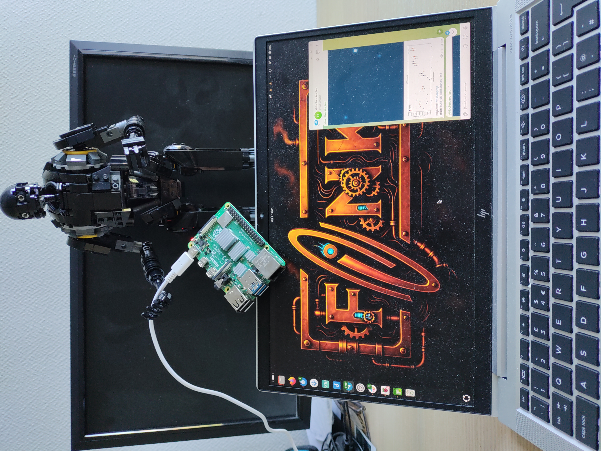

Redesigned CLI and a new bots service. Check out the release 12 of the Fink client!
<!--more-->



The Fink ecosystem has evolved rapidly in recent years. Initially, in 2020, the fink-client was only a wrapper around the Kafka consumer API to simplify the work of astronomers and other users performing follow-up with the Fink/ZTF Livestream service. In 2023 the client was expanded to support the Data Transfer service, and in 2025 support for the ZTF Xmatch service was added. Neither its core nor its interface changed much during that time.

With the start of LSST, the number of client connections and the need to access additional services grew quickly. For that reason we completely redesigned the CLI in version 12, and added a service to manage bots (an extension of the Livestream). We hope you enjoy it!

## Installation of fink-client

You would simply install the latest version of the client using pip in your terminal:

```bash
pip install fink-client --upgrade
```

Check the client is correctly installed by running:

```bash
finkctl
```

You should see the help menu, together with the version of the client. Your credentials remain valid, but **if you are coming from the client version 11, you will need a few changes for the client to work again.** Get more information online from the [ZTF](https://doc.ztf.fink-broker.org/services/fink_client/) or [LSST](https://doc.lsst.fink-broker.org/services/fink_client/) documentation websites.

## Fink bots

We all have our own habits for working and taking in information. Some prefer command-line interfaces, while others favor web interfaces or smartphone apps. Receiving alerts is no different. Although the fink-client is a convenient way to interact with Fink, we recognize it may not suit every use case or user.

A Fink bot is a program that listens to alerts from the Fink Livestream and forwards alert content to instant‑messaging apps such as Telegram or Slack. It makes it easy to scroll through alerts of interest on a smartphone or web interface. Bots existed during the Fink/ZTF era but were run inside the Fink platform. Starting with fink-client version 12, any user can now create and run a Fink bot independently.

Get more information online from the [ZTF](https://doc.ztf.fink-broker.org/services/bots/) or [LSST](https://doc.lsst.fink-broker.org/services/bots/) documentation websites.

## Build your Fink bot using a Raspberry Pi

Ideally, you should not run Fink bots on your laptop, because once you shut it down, the stream will stop. The Raspberry Pi is a particularly well-suited platform: it's easy to program and consumes very little energy, allowing it to run 24/7 without drawing much power.

This tutorial is made with a Raspberry Pi 4, with 8GB RAM (but honestly, 1GB RAM would be more than enough). 



Install the Rapsberry Pi OS Lite (64-bit) which is just under 500MB. Once flashed, plug a keyboard and a screen, and configure the wifi using `sudo raspi-config`. Then create a virtual environment in Python and install the fink-client:

```bash
python -m venv fink-env
source fink-env/bin/activate
pip install fink-client  # must be >=12
```

Check that the client is correctly installed:

```bash
finkctl  # should show the help
```

Then register your account (see [here](https://doc.lsst.fink-broker.org/services/fink_client/#how-to-register)), and follow the [bots configuration](https://doc.lsst.fink-broker.org/services/bots/). For this demo, we created a channel in Telegram. Then make a test by submitting only 1 alert to you channel:

```bash
finkctl stream -survey lsst -limit 1 --telegram
```

You should see a cutout and a lightcurve appearing in your channel on your smartphone for example. Then launch the client in background, unplug the keyboard and the screen, and put your Rapsberry Pi in a safe place to enjoy the streaming forever:

```bash
# put it as a background process and redirect log to telegram.log
nohup finkctl stream -survey lsst --telegram > telegram.log 2>&1 &
```


