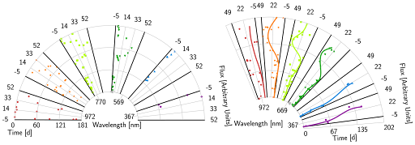

Extracting the full scientific potential from large photometric surveys demands richer data visualization than current methods provide.  
<!--more-->

The [Vera C. Rubin Observatory's Legacy Survey of Space and Time (LSST)](https://rubinobservatory.org/) exemplifies this challenge: its filter-based sampling of the light spectrum is intentionally sparse, yet the subtle details encoded in filter spacing, overlap, and sensitivity profiles carry critical information that standard light curve visualization discards.
  
To include this missing information we developed [LStein](https://lstein.readthedocs.io/en/latest/), an open-source, deterministic visualization approach: A set of lightcurves is placed in a combined angular coordinate system using azimuthal offsets to encode the sparse wavelength dimension. Using [LStein](https://lstein.readthedocs.io/en/latest/) you can display the relation between passbands (sparse dimension) while still showing individual light curves in a comparable manner. This enables researchers to include wavelength information in interpretations of the physical nature of signals.

An incorporation as an alternative way to explore light curves in the [Fink LSST science portal](https://lsst.fink-portal.org) is currently underway. You can also use [LStein](https://lstein.readthedocs.io/en/latest/) directly in your project as it is available on [GitHub](https://github.com/TheRedElement/LStein/tree/main )! Planned features for the future include additional interactive elements and different layout options. 

A detailed description of [LStein](https://lstein.readthedocs.io/en/latest/) can be found in [Steinwender *et al.* (2026)](https://doi.org/10.1016/j.ascom.2026.101161).
