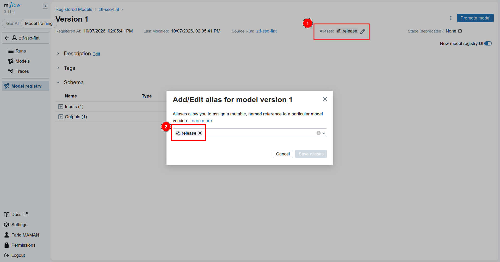
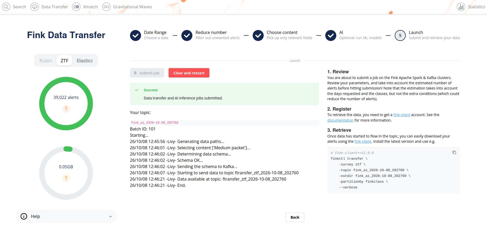

Register your model, and let Fink build and deploy it for you: no pull request, no waiting.
<!--more-->

Until now, adding or updating a machine learning model in Fink was a manual process: a pull request, back and forth with a member of the Fink team, and a new release of the broker. On top of that, all models had to share the same package versions. If you just wanted to test an idea, you had to be patient.

Fink AI changes this. It is a sandbox for science modules, open to everyone, from the scientific community to amateurs: anyone can publish a model, and anyone can use it.

## How does it work?

You log your model in the Fink [MLflow](https://mlflow.fink-broker.org) registry, together with a small preprocessing function that turns an alert into features. Any model type supported by MLflow works (scikit-learn, PyTorch, TensorFlow...), with the Python version and the packages you want, since each model runs in its own container.

Then you give your model version an alias, and that's it:

A CI/CD pipeline validates the preprocessing and the model, including performance tests, builds the Docker images and publishes them, with nobody in the loop. About 30 minutes later, your model appears in the [Fink Science Portal](https://ztf.fink-portal.org/download):

From there, anyone can select it, run it on ZTF alerts, and retrieve the predictions with the [fink-client](https://doc.ztf.fink-broker.org/services/fink_client/):

## What do you need?

To run existing models, you only need to update the [fink-client](https://doc.ztf.fink-broker.org/services/fink_client/) (version 12.3.0 or later). To publish your own, sign in to the [Fink MLflow](https://mlflow.fink-broker.org) with your [ORCID](https://orcid.org) or [eduGAIN](https://edugain.org) account, and ask us for access.

## What's next?

For the moment, Fink AI runs on historical ZTF data only. The goal is to run user models on the live alert stream.

Everything is described step by step in the [documentation](https://doc.ztf.fink-broker.org/services/fink_ai/). Give it a try, and contact us if something is not working (Slack, email, or GitHub)!

*This service was done in the context of the European Union’s Horizon Europe Research and Innovation Programme under Grant Agreement No. 101131928 (ACME).*
